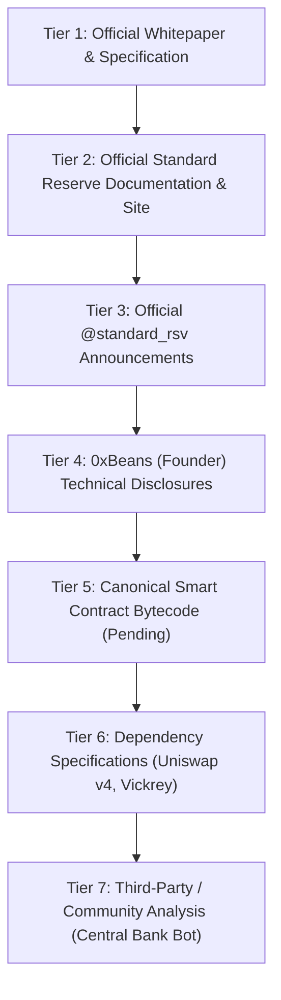

# REFLEX — Research Sources & Evidentiary Hierarchy

**REFLEX Research Laboratory**  
*Curated by Asad Lee (GitHub: [@Asadlee24](https://github.com/Asadlee24))*  
*Last Updated: September 2026*

REFLEX maintains an evidentiary separation between **primary protocol specifications**, **secondary community interpretations**, and **research assumptions**.

---

## Evidentiary Hierarchy

---

## Primary Sources Directory

### Tier 1 & 2: Official Protocol Documentation
- **Official Website**: [standardreserve.xyz](https://www.standardreserve.xyz/)
- **Whitepaper v1**: [standardreserve.xyz/whitepaper](https://www.standardreserve.xyz/whitepaper/)
- **Protocol Application Overview**: [standardreserve.xyz/app/protocol](https://www.standardreserve.xyz/app/protocol/)
- **Minting & Banker Guide**: [standardreserve.xyz/app/mint](https://www.standardreserve.xyz/app/mint/)
- **About Standard Reserve**: [standardreserve.xyz/app/about](https://www.standardreserve.xyz/app/about/)

### Tier 3 & 4: Official Accounts & Founder Disclosures
- **Official Twitter / X**: [@standard_rsv](https://x.com/standard_rsv)
- **Founder Twitter / X**: [@0xbeans](https://x.com/0xbeans)
- **Founder GitHub**: [github.com/0xBeans](https://github.com/0xBeans)
  - Reference Architectures: `DRIP20`, `Mirakai`, `IAmTheOptimizor`, `GenesisAndConclusion`

### Tier 6: Dependency & Auction References
- **Uniswap v4 Core Architecture**: [docs.uniswap.org/contracts/v4/overview](https://docs.uniswap.org/contracts/v4/overview)
- **Vickrey / Sealed-Bid Reference**: [github.com/Philogy/create2-vickrey-contracts](https://github.com/Philogy/create2-vickrey-contracts)

### Tier 7: Community Analysis (Non-Authoritative)
- **Central Bank Bot Methodology**: [centralbank.bot/methodology.html](https://centralbank.bot/methodology.html)
- **Central Bank Bot Simulator**: [centralbank.bot/simulator.html](https://centralbank.bot/simulator.html)

---

## Mandatory Citation Rules

1. **No Silent Truths**: A claim from a community tool (Tier 7) must never be presented as an official protocol rule (`CONFIRMED`).
2. **Explicit Uncertainty**: Redacted parameters are classified as `REDACTED` and bounded via configurable research assumptions.
3. **No Fake Authority**: SpecLab does not claim to have audited unreleased bytecode or received insider parameters.
