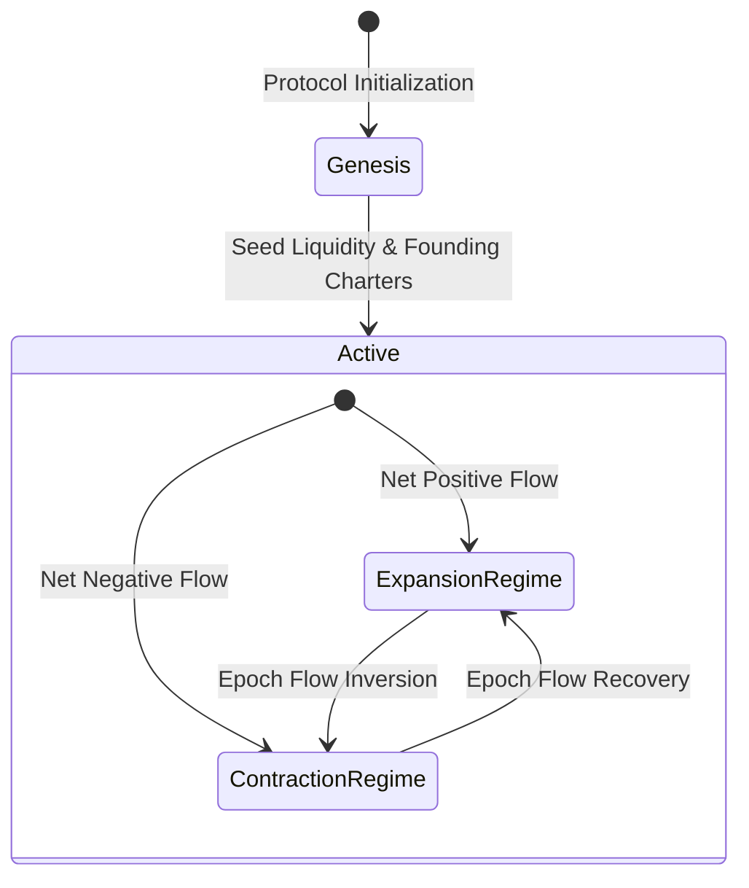
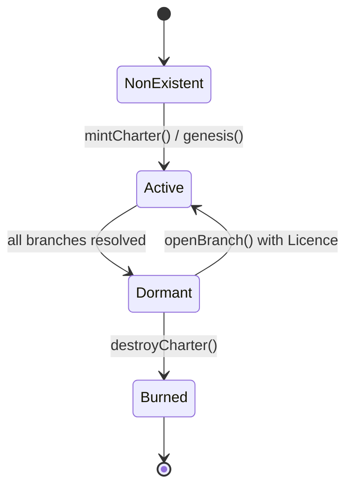
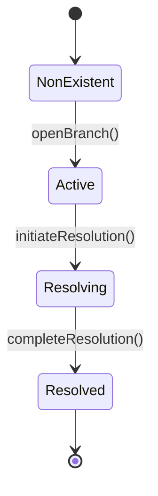
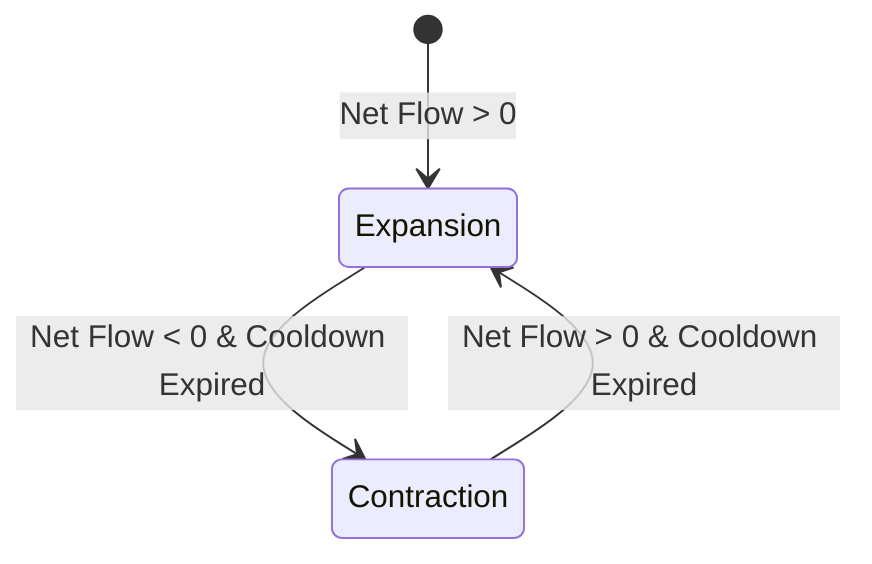

# Formal State Machine Specification

**REFLEX SpecLab — The Standard Reserve**  
*Curated by Asad Lee (GitHub: [@Asadlee24](https://github.com/Asadlee24))*

This specification defines the formal entity state machines, valid transitions, preconditions, accounting mutations, and invariant postconditions for The Standard Reserve protocol reference model.

---

## 1. Protocol Architecture & Domains

---

## 2. Entity State Machines

### 2.1 Charter Lifecycle (`CharterSpec`)

A Charter represents the institutional entity authorized to operate one or more operational Branches.

#### Transitions:

1. **`mintCharter(address owner, uint256 initialBranchCapacity)`**
   - **Preconditions:** Caller is authorized auction settlement or genesis allocator; `charters[id].status == NonExistent`.
   - **State Changes:** `status = Active`, `owner = owner`, `maxBranches = initialBranchCapacity`, `activeBranches = 0`.
   - **Accounting Effect:** None (or auction settlement fee transferred to Vault).
   - **Postconditions:** `charters[id].status == Active`.
   - **Source Rule:** `SR-CHARTER-001`.

2. **`openBranch(uint256 charterId)`**
   - **Preconditions:** `charter.status == Active`, `charter.activeBranches < charter.maxBranches`.
   - **State Changes:** `charter.activeBranches += 1`, new `Branch` instance instantiated in `Active` status.
   - **Accounting Effect:** Expansion licence burned if beyond initial capacity.
   - **Postconditions:** `charter.activeBranches <= charter.maxBranches`.
   - **Source Rule:** `SR-BRANCH-001`, `SR-BRANCH-002`.

3. **`resolveBranch(uint256 charterId, uint256 branchId)`**
   - **Preconditions:** `branch.status == Active`, `charter.activeBranches > 0`.
   - **State Changes:** `branch.status = Resolved`, `charter.activeBranches -= 1`. If `charter.activeBranches == 0`, `charter.status = Dormant`.
   - **Accounting Effect:** Accrued issuance realized minus Resolution Fee; 50% burned, 50% redistributed to remaining active branches.
   - **Postconditions:** `branch.status == Resolved`, `charter.activeBranches >= 0`.
   - **Source Rule:** `SR-BRANCH-003`, `SR-RESOLUTION-003`.

---

### 2.2 Branch Lifecycle (`BranchSpec`)

#### Transitions:

1. **`accrueIssuance(uint256 branchId, uint256 amount)`**
   - **Preconditions:** `branch.status == Active`, `remainingIssuanceBudget >= amount`.
   - **State Changes:** `branch.accruedIssuance += amount`, `totalUnmintedAccrual += amount`, `remainingIssuanceBudget -= amount`.
   - **Accounting Effect:** Ledger credit registered without inflating circulating supply.
   - **Postconditions:** `branch.accruedIssuance <= totalUnmintedAccrual`.
   - **Source Rule:** `SR-ISSUANCE-001`.

2. **`withdrawAccrued(uint256 branchId, uint256 amount)`**
   - **Preconditions:** `branch.status == Active`, `branch.accruedIssuance >= amount`.
   - **State Changes:** `branch.accruedIssuance -= amount`, `branch.totalRealized += amount`, `circulatingSupply += amount`.
   - **Accounting Effect:** ERC20 token minted to Banker address.
   - **Postconditions:** `circulatingSupply + totalUnmintedAccrual <= maxSupply`.
   - **Source Rule:** `SR-ISSUANCE-002`, `SR-SUPPLY-001`.

---

### 2.3 Policy Engine & Monetary Regimes (`PolicySpec`)

#### Transitions:

1. **`advanceEpoch(int256 netEthFlow)`**
   - **Preconditions:** `block.timestamp >= lastEpochTimestamp + epochDuration`.
   - **State Changes:** `currentEpoch += 1`, `lastEpochTimestamp = block.timestamp`.
   - **Accounting Effect:** If `netEthFlow >= 0`, `regime = Expansion`, policy multiplier adjusted according to demand envelope. If `netEthFlow < 0`, `regime = Contraction`, buffer reserves activated.
   - **Postconditions:** Policy multiplier stays within `[minMultiplier, maxMultiplier]`.
   - **Source Rule:** `SR-POLICY-001`, `SR-POLICY-002`, `SR-POLICY-003`.

---

### 2.4 Resolution Module (`ResolutionSpec`)

1. **`computeResolutionFee(uint256 trailingWithdrawals, uint256 remainingHeldValue)`**
   - **Formula:** $P = \frac{W}{\max(D + W, \epsilon)}$, $F(P) = F_{min} + (F_{max} - F_{min}) \cdot \min(1, \frac{P}{S})^2$.
   - **Postconditions:** $F(P) \in [F_{min}, F_{max}]$.
   - **Source Rule:** `SR-RESOLUTION-001`, `SR-RESOLUTION-002`.

2. **`distributeResolutionFee(uint256 grossFee)`**
   - **Split:** $\text{burned} = \lfloor \text{grossFee} / 2 \rfloor$, $\text{redistributed} = \text{grossFee} - \text{burned}$.
   - **Postconditions:** $\text{burned} + \text{redistributed} == \text{grossFee}$.
   - **Source Rule:** `SR-RESOLUTION-003`.
